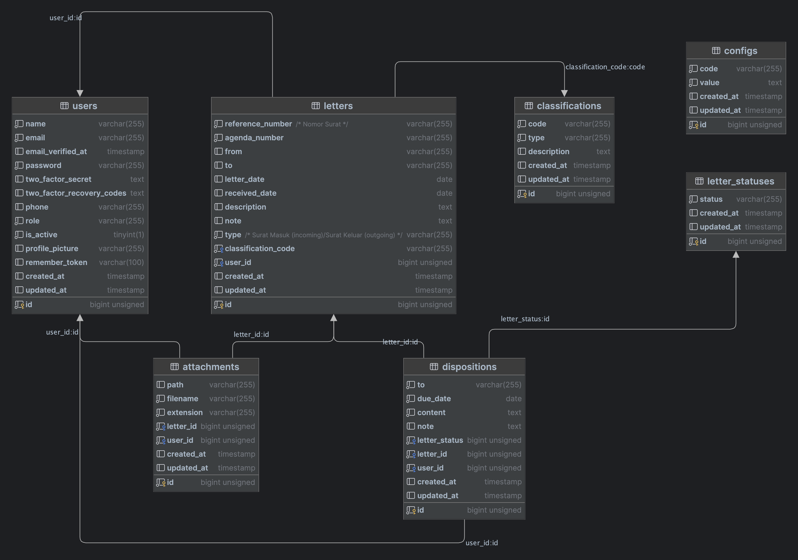
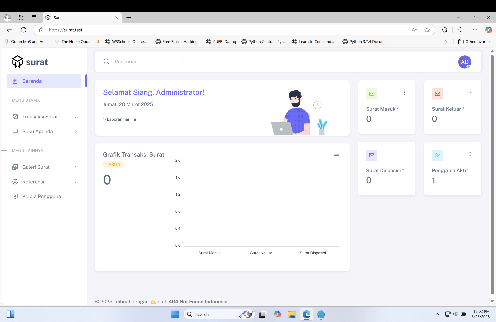

<p align="center">
  <a href="https://404notfound.fun" target="_blank">
    
  </a>
</p>


## Laravel Surat Menyurat v1 🚀

Sebuah aplikasi web yang dirancang untuk mengelola surat masuk, keluar, dan disposisi dengan lebih efisien, cepat, dan terorganisir. Dengan fitur pencatatan, pencarian, serta pelacakan surat yang intuitif, proses administrasi jadi lebih simpel dan nggak ribet!

## ✨ Fitur Andalan

- **🔑 Autentikasi & Hak Akses**  
  - Login/logout gampang
  - Hak akses berbasis peran (admin, staff) biar nggak semua orang bisa asal ubah
- **📊 Dashboard Super Informatif**  
  - Statistik jumlah surat masuk, keluar, dan disposisi hari ini
  - Statistik jumlah transaksi surat hari ini
  - Jumlah pengguna aktif
  - Persentase kenaikan/penurunan surat & transaksi surat
- **📥 Manajemen Surat Masuk**  
  - Tambah, edit, hapus, dan lihat detail surat masuk
  - Pencarian cepat berdasarkan pengirim, nomor surat, atau nomor agenda
  - Kelola lampiran surat masuk dengan mudah
  - Tambah & hapus disposisi surat
- **📤 Manajemen Surat Keluar**  
  - Tambah, edit, hapus, dan lihat detail surat keluar
  - Pencarian gampang berdasarkan pengirim, nomor surat, atau nomor agenda
  - Kelola lampiran surat keluar
- **📅 Agenda Surat**  
  - Cari surat masuk & keluar berdasarkan tanggal
  - Cetak agenda surat masuk & keluar
- **🖼️ Galeri Surat**  
  - Lihat dan unduh lampiran surat masuk & keluar
- **📂 Referensi Data**  
  - Klasifikasi surat (tambah, edit, hapus)
  - Status sifat surat (tambah, edit, hapus)
- **👥 Kelola Pengguna (Admin)**  
  - Tambah, edit, hapus, dan nonaktifkan pengguna
  - Reset password pengguna dengan mudah
- **🛠️ Pengaturan Profil**  
  - Ubah nama, email, dan nomor telepon
  - Ganti foto profil biar makin kece
  - Nonaktifkan akun (khusus staff)
- **⚙️ Pengaturan Sistem (Admin)**  
  - Konfigurasi kata sandi bawaan
  - Atur jumlah data per halaman
  - Ubah identitas aplikasi & institusi (nama, alamat, kontak)

## 🛢️ Skema Database


Bisa didownload di [sini](docs/surat.sql).

## ⚡ Instalasi Super Cepat
### 🔥 Persyaratan
- **PHP > 8.1.0**
- **MySQL**

### 🚀 Setup dengan Makefile (Paling Gampang)
1. Clone repository ini, lalu jalankan:
   ```sh
   make setup
   ```
2. Buat database baru di MySQL dan sesuaikan `.env`
3. Jalankan setup database:
   ```sh
   make setup-db
   ```
4. (Opsional) Tambahkan data dummy:
   ```sh
   make setup-dummy
   ```
5. Jalankan aplikasi:
   ```sh
   make run
   ```

### 🛠️ Setup Manual (Kalau Mau Cara Lama)
1. Clone repository ini, lalu jalankan:
   ```sh
   composer install
   ```
2. Salin konfigurasi default:
   ```sh
   cp .env.example .env
   ```
3. Sesuaikan `.env` dengan database Anda.
4. Generate application key:
   ```sh
   php artisan key:generate
   ```
5. Buat symbolic link untuk storage:
   ```sh
   php artisan storage:link
   ```
6. Jalankan migrasi database:
   ```sh
   php artisan migrate
   ```
7. Tambahkan akun administrator:
   ```sh
   php artisan db:seed --class=UserSeeder
   ```
8. Tambahkan konfigurasi awal:
   ```sh
   php artisan db:seed --class=ConfigSeeder
   ```
9. (Opsional) Tambahkan data dummy:
   ```sh
   php artisan db:seed
   ```
10. Jalankan aplikasi:
   ```sh
   php artisan serve
   ```


## 🔑 Login
Gunakan akun berikut buat masuk:

| Surel            | Kata Sandi |
|------------------|------------|
| admin@admin.com | admin      |

## 🌍 Pengaturan Bahasa
Aplikasi ini support Bahasa Indonesia & Inggris. Ubah `config/app.php` bagian `locale` jadi `id` atau `en`.

## ⏰ Pengaturan Zona Waktu
Ubah `timezone` di `config/app.php` sesuai kebutuhan. Lihat daftar zona waktu di sini: [PHP Timezones](https://www.php.net/manual/en/timezones.php).

## 📸 Screenshot



## 🎥 Demo
Tonton demo proyek ini di [YouTube](https://www.youtube.com/watch?v=dyatVEGavxo).

## 🎨 Template
Proyek ini pakai template admin [Sneat](https://github.com/themeselection/sneat-html-admin-template-free).

## 📜 Lisensi
Berlisensi di bawah [MIT License](LICENSE).